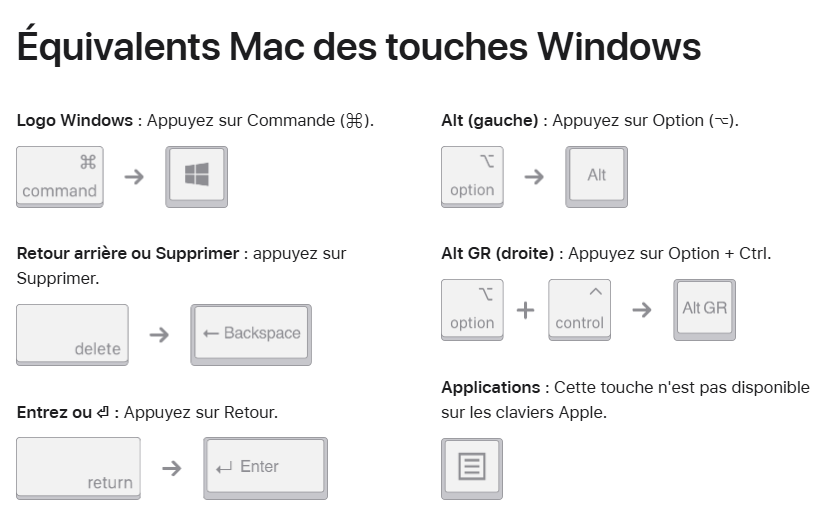

# Pilotes Apple Magic Keyboard et Magic Mouse pour Windows
Pour pouvoir utiliser votre Magic Mouse et votre Magic Keyboard sur un ordinateur Windows vous devez installer l'ensemble des pilotes spécifiques d'Apple.

## Compatibilité
- Keyboard : AZERTY
- Mouse : International

## Magic Keyboard
Par défaut le mapping des touches du Magic Keybord n'est pas correcte. Vous devez installer le maping des touches spécifique au clavier Apple.  
Pour corriger cela il faut simplement ajouter le layer des claviers Apple :
1. [Téléchargez le .zip correspondant au Magic Keyboard](Clavier-AppleFr-sansfil-Windows-v2.zip)
2. Extrayez les fichiers
3. Installez le `setup` avec les droits admins
4. Redémarrer votre pc
5. Ouvrez les "Paramètres" du pc.  
Heure et Langue > Langue et région >  
Français (France) ⁝ > Option linguistiques > Ajouter un clavier
6. Dans la liste trouvez `Clavier Français -> Apple sans fil`

**Note :** Si vous avez plusieurs dispositions de claviers vous pouvez intervertir à partir des lettres FRA en bas à droite dans la barre des tâches.

**Note :** Comme le présente l'image précédente. Certaines touches possèdent un mapping différent entre une machine Apple et Windows. [Veuillez vous réferer à cette page](https://support.apple.com/en-us/102221)

## Magic Mouse
Le pilote installé par défaut par Microsoft lors de la connexion de votre Magic Mouse est imparfait et ne vous permets pas de scroller. Pour résoudre ce problème nous allons installer le pilote d'Apple :

0. Pramètres > Bluetooth : Supprimez votre souris si elle est déjà connecté à votre ordinateur.
1. [Télécharger le .zip correspondant à la Magic Mouse](AppleWirelessMouse.zip)
2. Extrayez les fichiers
3. Cliquez droit sur **AppleWirelessMouse.inf** puis `Installer`
4. Paramètres > Bluetooth : Ajoutez l'appareil pour connectez votre Magic Mouse
---

---
magic keyboard on windows  
magic mouse on windows  
How to Connect an Apple Wireless Keyboard to Windows 10 and Windows 11
Comment utiliser un clavier Mac sous Windows ?  
Magic Keyboard and Mouse for Windows  
Magic Keyboard Layouts
